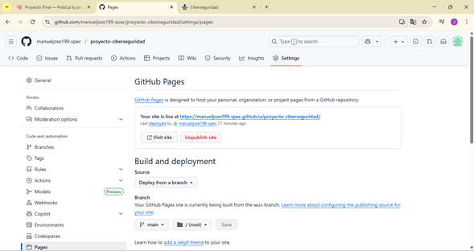
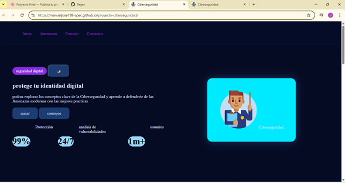
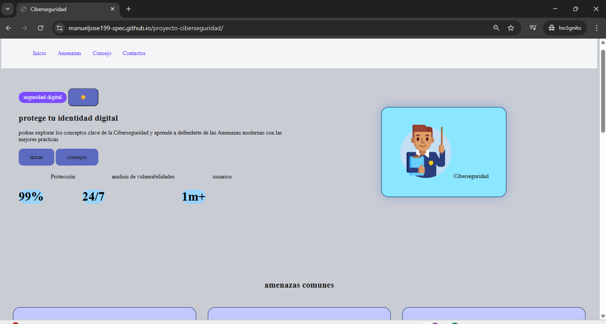

## URL activa

## sitio abierto en el navegador

- Tema Oscuro
 

- Tema claro
  

## Aprendizajes

1. ¿Qué fue lo más fácil y lo más retador
   
   - Crear la estructura básica del proyecto con HTML
   - Organizar los archivos en carpetas
   - Publicar la página

2. Lo más retador:
   
   -Usar etiquetas semánticas en toda la estructura
   -Resolver detalles de diseño y ajuste de los componentes
   
3. ¿Qué etiquetas semánticas usaste y por qué?
   
   <header> para la cabecera  de la página y el menu
   <nav> para el contener el contenido principal de la pagina
   <section> dividir el contenido en bloques organizados
   <footer>para informaacion final

4. ¿Cómo organizaste tus commits?
   
   - feat: para agregar funcionalidades nuevas
   - docs: para documentación
   - fix: para corregir errores 
  
- también agregie comits pequeños y frecuentes para:
  
  1 rastrear cambios facilmente
  2 evitar conflictod
  3 hacer mas entendible el proyecto

5. ¿Qué mejorarías en la siguiente iteración?
   
   - la estructura CSS mejorando los estilos
   - la accesibilidad y responsivo
   - un mejor flujo y estructura
   - consumir servicios extrenos como APIS
    